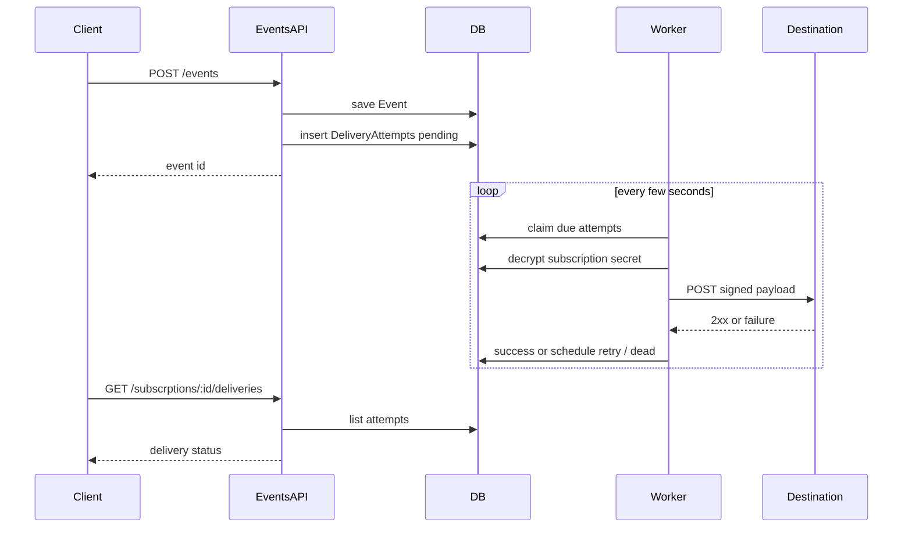

# Implement Missing Webhook Relay Capabilities

## Chosen approach

- **Async DB outbox** (not sync-in-request): creating an event enqueues delivery rows; a background worker delivers them. Slow/down destinations cannot block `POST /events`.
- **No Redis/Bull**: reuse SQLite + TypeORM; Node built-in `fetch` for outbound HTTP; in-process poller via `OnModuleInit`/`setInterval` (no new queue packages).
- **HMAC-SHA256** over the exact request body, using the decrypted `destinationSecret`.
- Keep existing route spelling `subscrptions` for consistency with current API.

## 1. Delivery data model

Add entity [`nestjs-version/src/modules/deliveries/entities/delivery-attempt.entity.ts`](nestjs-version/src/modules/deliveries/entities/delivery-attempt.entity.ts):

- `id`, `eventId`, `subscriptionId`
- `status`: `pending` | `in_progress` | `success` | `failed` | `dead`
- `attemptCount`, `maxAttempts` (default **5**)
- `nextAttemptAt`, `lastHttpStatus`, `lastError`, `durationMs`
- `createdAt`, `updatedAt`, `deliveredAt` (nullable)
- Unique index on `(eventId, subscriptionId)` so fan-out is idempotent if event create is retried

## 2. Fan-out on event create

Extend [`events.service.ts`](nestjs-version/src/modules/events/events.service.ts) after a **new** event is saved (skip on idempotent replay):

1. Query subscriptions whose `eventTypes.name` matches `event.eventType` (join via existing [`SubscriptionEventType`](nestjs-version/src/modules/subscriptions/entities/subscription-event-type.entity.ts)).
2. Insert one `DeliveryAttempt` per match with `status=pending`, `nextAttemptAt=now`.
3. Return the same event response shape as today.

Wire modules: new `DeliveriesModule`; export a `DeliveryService.enqueueForEvent(event)`; import it from [`EventsModule`](nestjs-version/src/modules/events/events.module.ts). Export subscription query helpers / repos from [`SubscripionsModule`](nestjs-version/src/modules/subscriptions/subscripions.module.ts) as needed (today it only exports `EncryptionService`).

## 3. Delivery worker + resilient HTTP

New services under `modules/deliveries/`:

| Piece | Responsibility |
|---|---|
| `DeliveryWorker` | Interval poll (~2s): claim due rows (`pending`/`failed` where `nextAttemptAt <= now` and `attemptCount < maxAttempts`), mark `in_progress`, process with limited concurrency (e.g. 5) |
| `WebhookClient` | `fetch` POST to `destinationUrl`, **5s timeout** (`AbortSignal`), headers below |
| `DeliveryService` | Claim/update attempts; compute next retry; mark `success` / `dead` |

**Retry policy:** exponential backoff `2^attemptCount` seconds (capped, e.g. 5 min). Non-2xx, network errors, and timeouts → increment `attemptCount`, set `lastError` / `lastHttpStatus`, schedule `nextAttemptAt`, status `failed`; when attempts exhausted → `dead`.

**Signing (authenticity):**

- Body: stable JSON of `{ id, eventType, payload }` (event id + type + original payload).
- Header `X-Webhook-Signature: sha256=<hex>` where hex = HMAC-SHA256(body, decrypted secret).
- Also send `X-Event-Id`, `X-Event-Type`, `Content-Type: application/json`.

Decrypt via existing [`EncryptionService.decrypt`](nestjs-version/src/modules/subscriptions/encryption.service.ts) at send time only.

## 4. “See what happened” API

Add to [`subscrptions.controller.ts`](nestjs-version/src/modules/subscriptions/subscrptions.controller.ts) (auth already on controller):

`GET /api/v1/subscrptions/:id/deliveries?page=&limit=`

- 404 if subscription missing
- Paginated list of attempts for that subscription: `id`, `eventId`, `status`, `attemptCount`, `lastHttpStatus`, `lastError`, `durationMs`, `nextAttemptAt`, `deliveredAt`, `createdAt`, `updatedAt`

Implement in `DeliveryService.listBySubscription`; keep controller thin.

## 5. Module wiring

- Create `DeliveriesModule` (entity, `DeliveryService`, `WebhookClient`, `DeliveryWorker`).
- Register in [`app.module.ts`](nestjs-version/src/app.module.ts).
- `EventsModule` imports `DeliveriesModule`; `DeliveriesModule` imports TypeORM for `DeliveryAttempt`, `Event`, `Subscription` (+ event-type), and `EncryptionService` from subscriptions.

## 6. Small fix while touching create path

In [`subscription.service.ts`](nestjs-version/src/modules/subscriptions/subscription.service.ts) `createSubscription`, assign saved `eventTypes` onto the entity (or reload with relations) before `toSubscriptionResponse` so the create response is not empty/broken.

## Out of scope (deliberate)

- Redis/Bull, multi-instance claim locking, DELETE subscription, auth user table, renaming `subscrptions` typo, full e2e suite rewrite.
- README production notes can be added later if you ask.

---

## Webhook delivery gaps
"Implement the missing relay core: fan-out events to matching subscriptions via a SQLite-backed delivery outbox, HMAC-signed HTTP POSTs with retries/backoff, and a delivery-status API—without adding Redis or heavy queue deps."

- Add DeliveryAttempt entity + DeliveriesModule skeleton
- Enqueue delivery attempts from EventsService on new events
- Implement worker, fetch client, HMAC signing, retry/backoff
- Add GET subscrptions/:id/deliveries paginated endpoint
- Fix createSubscription response to include eventTypes

