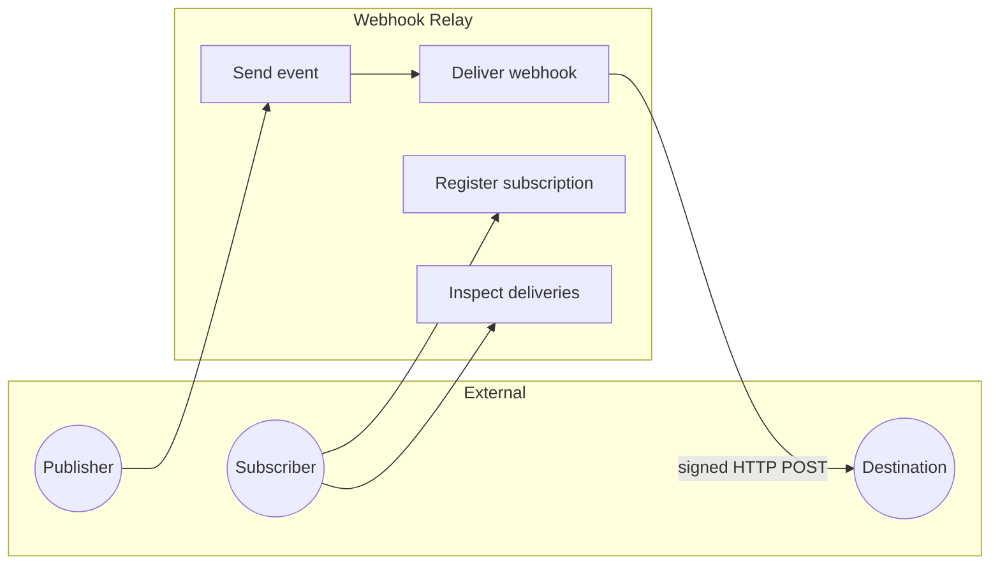
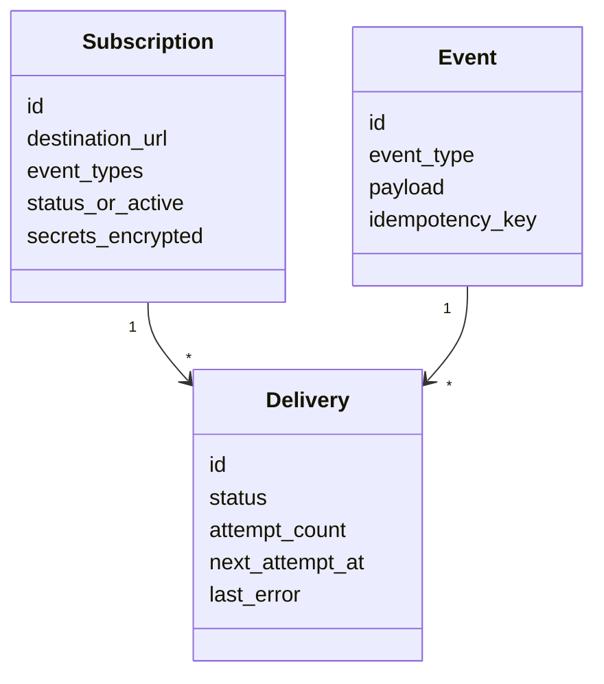
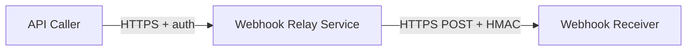
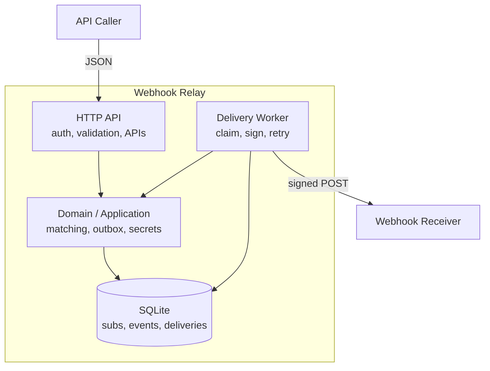
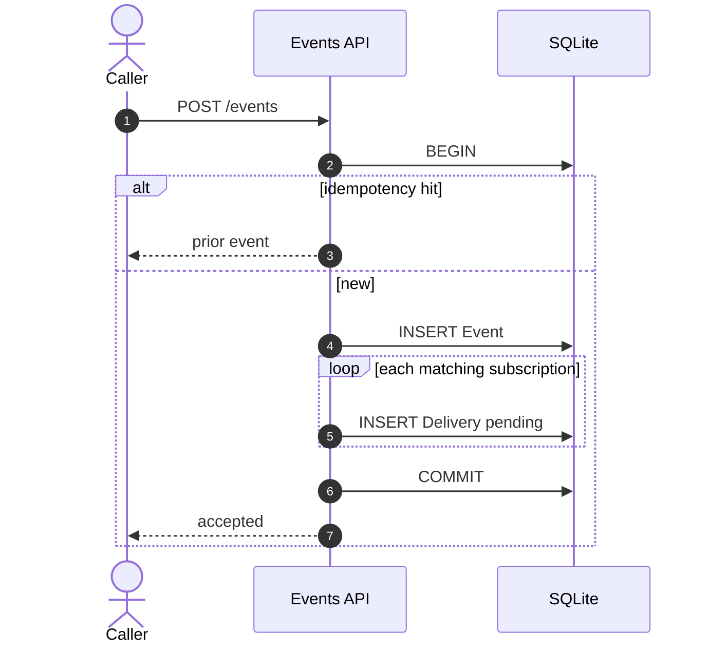
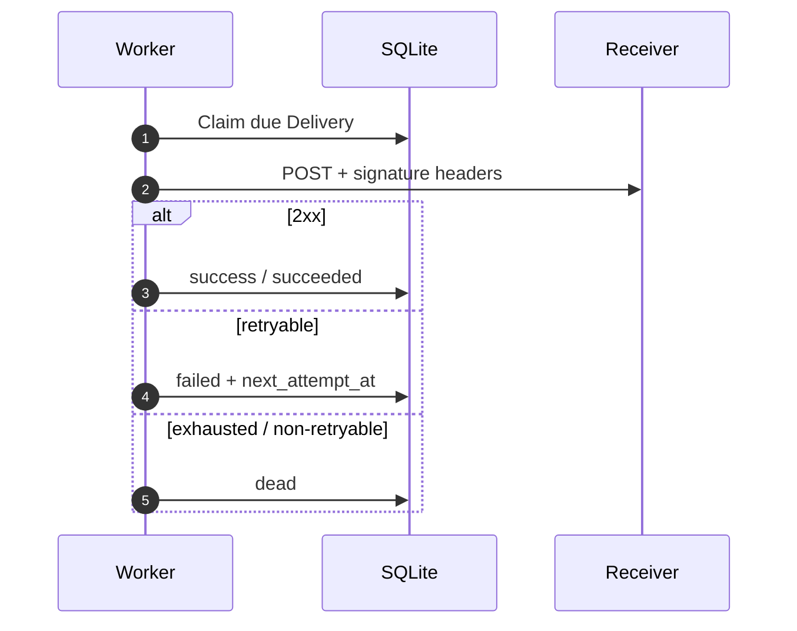
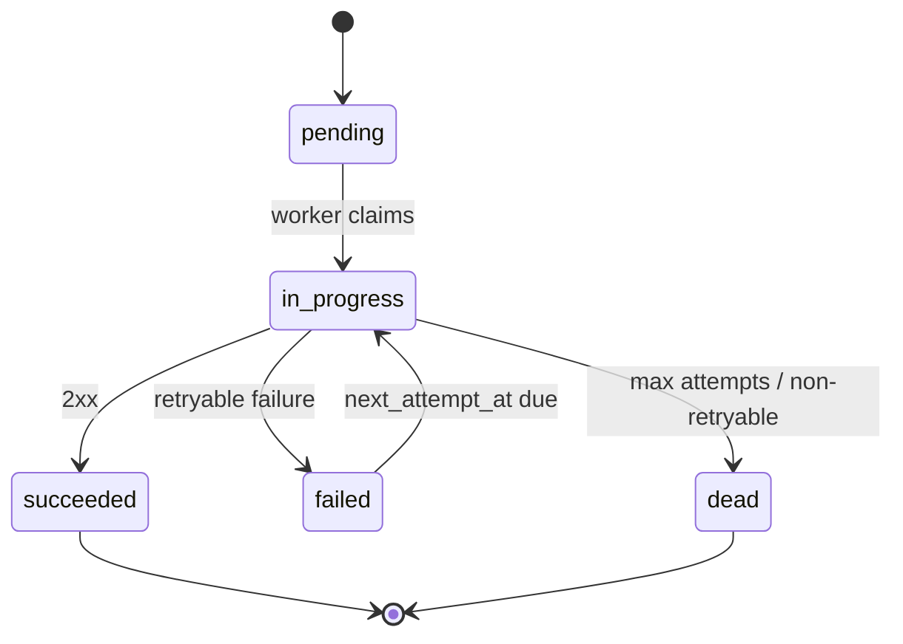

# Architecture Document — Webhook Relay Service

**Project:** `tjmlabs-task-home`  
**Product brief:** [`../requirements.md`](../requirements.md)  
**Implementations:** Python (Django) · NestJS (TypeScript)  
**Status:** Shared architecture (both stacks implemented)  
**Authors:** System Analysis · Backend Architecture

---

## Executive summary

Build a lean **webhook relay**: callers register destinations and event-type interest; producers submit events once; the service **matches, queues, delivers, retries, signs**, and exposes delivery status—while protecting stored credentials.

**Shared MVP shape:** modular monolith, REST API, **DB-backed outbox** (delivery rows), background worker, HMAC-SHA256 outbound signatures, encrypted secrets at rest. No Celery/Redis/Bull for the take-home; upgrade path documented.

Two stacks implement the same product with different auth, field naming, signing details, and worker process model (see §3).

**Success signal:** correct under flaky destinations, auditable deliveries, named trade-offs, honest deferrals—not distributed-systems theater.

---

## 1. System analysis (shared)

### 1.1 Problem statement

Without a relay, producers must fan out themselves, handle retries/timeouts, and prove payload authenticity. This service is a durable middle layer: register destinations → submit events → reliable signed delivery → inspect outcomes.

### 1.2 Actors

| Actor | Goals |
| --- | --- |
| **Publisher** | Submit events once; matching subscriptions get them |
| **Subscriber** | Register destinations; inspect deliveries; trust authenticity |
| **Destination receiver** | Accept signed POSTs; reject forgeries |
| **Operator** | Dependable delivery under SQLite/single-node limits |

### 1.3 Functional requirements (MoSCoW)

**MUST**

| ID | Requirement |
| --- | --- |
| FR-M01 | Create subscription (URL + event types + credential material); return ids/secrets needed later |
| FR-M02 | Accept event; persist; enqueue delivery to every matching active subscription |
| FR-M03 | HTTP POST each pending delivery with a verifiable body |
| FR-M04 | Retry with backoff on flaky destinations; do not block publish on remote latency |
| FR-M05 | Sign outbound payloads (HMAC) |
| FR-M06 | Encrypt destination credentials at rest; never return plaintext on read |
| FR-M07 | Expose delivery status (pending / in progress / success|succeeded / failed / dead, attempts, last error) |
| FR-M08 | Authenticate callers for mutating and sensitive reads |

**SHOULD:** idempotent ingest; delivery metadata headers; payload size limits; attempt history; health endpoints.

**COULD (deferred):** manual redelivery; event-type registry; payload predicates; multi-tenant UI; circuit breakers; URL ownership challenge.

### 1.4 Non-functional requirements

| ID | Category | Requirement |
| --- | --- | --- |
| NFR-R01 | Reliability | Publish returns only after event + delivery rows are committed; delivery is async |
| NFR-R02 | Reliability | Timeouts/5xx/network → retry; non-retryable 4xx → terminal where implemented |
| NFR-R03 | Reliability | At-least-once; receivers must be idempotent |
| NFR-S01–S04 | Security | TLS at edge (prod); HMAC authenticity; encrypted secrets; SSRF controls (harden before prod) |
| NFR-O01 | Observability | Correlate by event / delivery / subscription identifiers |
| NFR-P01–P02 | Performance | Fast accept path; mandatory HTTP client timeouts |
| NFR-M01 | Maintainability | Lean deps; automated tests for matching, signing, retry, auth, redaction |

### 1.5 Domain vocabulary

| Term | Definition |
| --- | --- |
| **Subscription** | Destination URL + event-type interest + signing/credential material |
| **Event type** | Exact-match string label (e.g. `order.created`) |
| **Event** | Immutable accepted message: type + JSON payload |
| **Delivery** | Per-(event, subscription) work unit (aka delivery attempt row) |
| **Signing / destination secret** | Material used to HMAC and/or authorize outbound calls; encrypted at rest |

### 1.6 Business rules

- Fan-out to **all matching** subscriptions whose event-type set contains the event type.
- Inactive/deleted subscriptions get no new deliveries (where soft-delete exists).
- **At-least-once** delivery (crash between HTTP 2xx and DB commit can duplicate).
- Destination secrets never returned after write; signing secrets shown at most once where the stack issues them.
- Payload is opaque JSON; relay does not interpret business fields.
- No Kafka/Celery/Redis/Bull in MVP.

### 1.7 Out of scope (MVP)

Celery/Redis/Kafka/Bull, multi-tenant console, exactly-once, full KMS rotation UX, payload filtering DSL, URL ownership verification, Prometheus/OTel backends.

### 1.8 Acceptance criteria (testable)

1. Create subscription succeeds; subsequent GET does not expose destination credential.
2. Matching: `order.created` hits only subscriptions interested in that type.
3. Publish stays fast when destination is slow; delivery records retry/failure asynchronously.
4. Fail-then-succeed destination → success with `attempt_count > 1`.
5. Always-fail → terminal `dead` with last error visible.
6. HMAC recomputed with the stack’s documented scheme matches; tampering fails.
7. Credential used on outbound as designed; never in list/get/logs.
8. Inspect API shows status, attempts, timestamps, safe errors.
9. Missing/invalid auth → reject.
10. Same idempotency key + same payload → single fan-out (no duplicate deliveries).

### 1.9 Assumptions

- Single-tenant take-home auth (API key **or** JWT stub—not OAuth).
- Free-form event-type strings.
- In-process or sibling worker + DB-as-queue is acceptable.
- SQLite is fine locally.

---

## 2. Shared software architecture

### 2.1 Style

**Modular monolith** with thin HTTP adapters → application services → ORM / HTTP adapters. API and worker share domain services (same process or sibling process).

**Core patterns:** transactional outbox, at-least-once delivery, idempotent ingest, exponential backoff, HMAC authenticity, encrypted secrets at rest.

### 2.2 C4 — System context

### 2.3 C4 — Containers (logical)

### 2.4 Key sequences (shared)

#### Ingest event + fan-out

#### Delivery with retry

### 2.5 Delivery status machine

> NestJS names the success status `success` instead of `succeeded`.

### 2.6 Shared ADRs

| ADR | Decision | Why |
| --- | --- | --- |
| ADR-001 | DB-backed queue, not Celery/Redis/Bull | Durable fan-out + inspection with lean ops |
| ADR-002 | Transactional outbox on ingest | Prevents accepted-but-lost deliveries |
| ADR-003 | At-least-once + inspectable attempts | Exactly-once needs receiver cooperation |
| ADR-004 | HMAC-SHA256 outbound | Familiar authenticity without mTLS |
| ADR-005 | Encrypt secrets at rest | Decrypt only on deliver/rotate paths |
| ADR-006 | Async deliver (never in request path) | Protects API from flaky destinations |

---

## 3. Implementation comparison

| Concern | Python (`python-version/`) | NestJS (`nestjs-version/`) |
| --- | --- | --- |
| Stack | Django · django-ninja · uv · pytest | NestJS · TypeORM · pnpm |
| Base URL | `http://127.0.0.1:8000` | `http://localhost:3000` |
| API prefix | `/api/v1` | `/api/v1` |
| Auth | Bearer API key `whr_…` (`create_api_key`) | JWT via `POST /auth/get-token` (`admin`/`admin`) |
| Field style | snake_case | camelCase |
| Subscription path | `/subscriptions` | `/subscrptions` (intentional typo) |
| Create secret UX | Returns `signing_secret` (`whsec_…`) once; optional `destination_secret` | Caller supplies required `destinationSecret`; never returned |
| Crypto at rest | Fernet (`WEBHOOK_RELAY_FERNET_KEY`) | AES-256-GCM (`ENCRYPTION_KEY`) |
| HMAC scheme | `v1=<hex>` over `{timestamp}.{body}`; ±300s skew | `sha256=<hex>` over raw body only |
| Outbound headers | `X-Webhook-Id`, `X-Webhook-Timestamp`, `X-Webhook-Signature`, `X-Webhook-Event-*`; optional `Authorization: Bearer` | `X-Webhook-Signature`, `X-Event-Id`, `X-Event-Type` |
| Event ingest status | `202` new / `200` replay | `201` new and replay |
| Retries | 4 attempts; 1s → 5s → 25s; 408/429/5xx retryable | 5 attempts; `2^n`s (cap 5 min); any non-2xx retryable |
| Worker | Separate `run_delivery_worker` | In-process cron (~5s) |
| Deliveries list | JSON array | `{ deliveries, total }` paginated |
| Postman | [`postman/webhook_relay_python…`](postman/webhook_relay_python.postman_collection.json) | [`postman/webhook_relay_nestjs…`](postman/webhook_relay_nestjs.postman_collection.json) |

---

## 4. Python backend architecture

### 4.1 Auth

| Mechanism | Detail |
| --- | --- |
| Scheme | `Authorization: Bearer <api_key>` |
| Format | `whr_` + urlsafe random |
| Storage | SHA-256 hash; prefix for display |
| Provisioning | `manage.py create_api_key` |

### 4.2 API surface (core)

| Method | Path | Purpose |
| --- | --- | --- |
| POST | `/subscriptions` | Register; returns `signing_secret` once → `201` |
| GET | `/subscriptions/{id}` | Detail (no signing secret) |
| POST | `/events` | Ingest → `202` (or `200` idempotent replay) |
| GET | `/subscriptions/{id}/deliveries` | Inspect |

**Error envelope:** `{ "error": { "code": "...", "message": "...", "details": {} } }`

### 4.3 Delivery engine

| Concern | Policy |
| --- | --- |
| Worker | `manage.py run_delivery_worker` |
| Claim | Optimistic CAS + lease reclaim ~2 min |
| Timeout | 5s |
| Attempts | 4 total; backoff **1s → 5s → 25s** |
| Signature | HMAC-SHA256(`{timestamp}.{raw_body}`, `signing_secret`) → `v1=<hex>` |

Canonical body includes sorted keys: `{ "id", "payload", "type" }`.

### 4.4 Layout

See [`python-core-implementation-plan.md`](python-core-implementation-plan.md) and [`../python-version/README.md`](../python-version/README.md).

---

## 5. NestJS backend architecture

### 5.1 Auth

| Mechanism | Detail |
| --- | --- |
| Issue | `POST /api/v1/auth/get-token` with `{ "username": "admin", "password": "admin" }` |
| Use | `Authorization: Bearer <access_token>` |
| Config | `JWT_SECRET`, `JWT_EXPIRES_IN` |

### 5.2 API surface

| Method | Path | Purpose |
| --- | --- | --- |
| POST | `/auth/get-token` | JWT → `201` |
| GET | `/subscrptions` | List (paginated) |
| POST | `/subscrptions` | Create → `201` |
| PUT | `/subscrptions` | Upsert by `destinationUrl` |
| GET | `/subscrptions/:id` | Detail (no secret) |
| GET | `/subscrptions/:id/deliveries` | Paginated inspect |
| POST | `/events` | Ingest → `201` |

**Error envelope:** `{ "success": false, "statusCode", "message", "errors?", "timestamp", "path" }`

### 5.3 Delivery engine

| Concern | Policy |
| --- | --- |
| Worker | `@nestjs/schedule` cron in same process (~5s, batch 5) |
| Timeout | 5s (`fetch` + `AbortSignal`) |
| Attempts | 5 total; backoff **`2^attemptCount`** seconds (cap 5 min) |
| Signature | HMAC-SHA256(body, `destinationSecret`) → `sha256=<hex>` |

Outbound body: `{ "id", "eventType", "payload" }`.

### 5.4 Modules

`auth` · `subscriptions` · `events` · `deliveries` · shared exception filter.

See [`../nestjs-version/README.md`](../nestjs-version/README.md).

---

## 6. Trade-offs & evolution

| Decision | Chose | Rejected | Why |
| --- | --- | --- | --- |
| Queue | DB outbox + worker | Celery/Redis/Bull | Lean; enough for take-home |
| Ingest vs deliver | Async enqueue only | Sync HTTP in request | Protects API from flaky destinations |
| Auth | API keys (Python) / JWT stub (Nest) | OAuth2 | Right size for S2S MVP |
| Signing variants | Timestamp+secret (Python) vs body+destinationSecret (Nest) | JWT / mTLS | Both are valid webhook patterns; Nest favors simpler verify |

### Harden before production (both)

Postgres + `SKIP LOCKED`, multi-worker fairness, circuit breaker, KMS + rotation, rate limits, full SSRF egress policy, metrics/tracing, TLS-only destinations, delivery replay API.

### Deliberately left out

Public signup UI, payload transformation DSL, multi-region brokers, exactly-once, admin dashboard.

---

*End of architecture document.*
