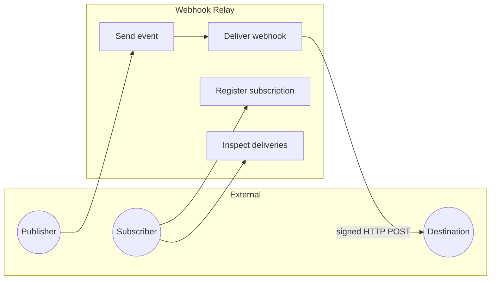
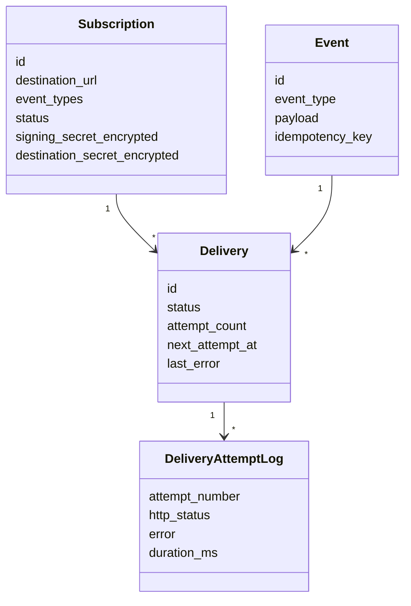
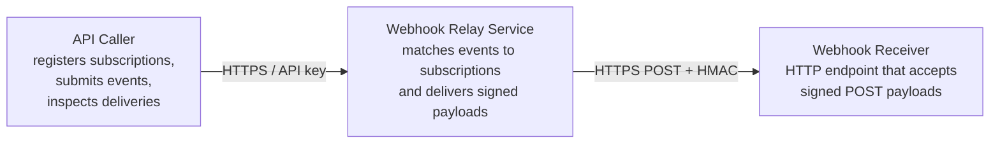
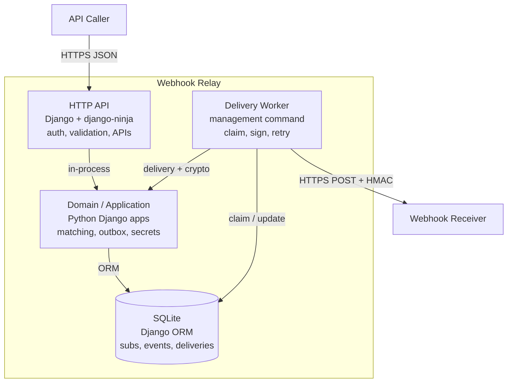
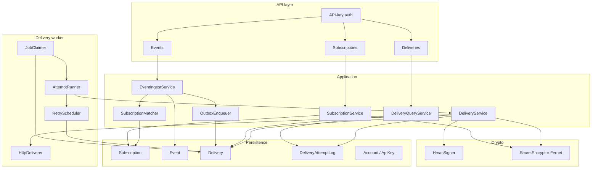
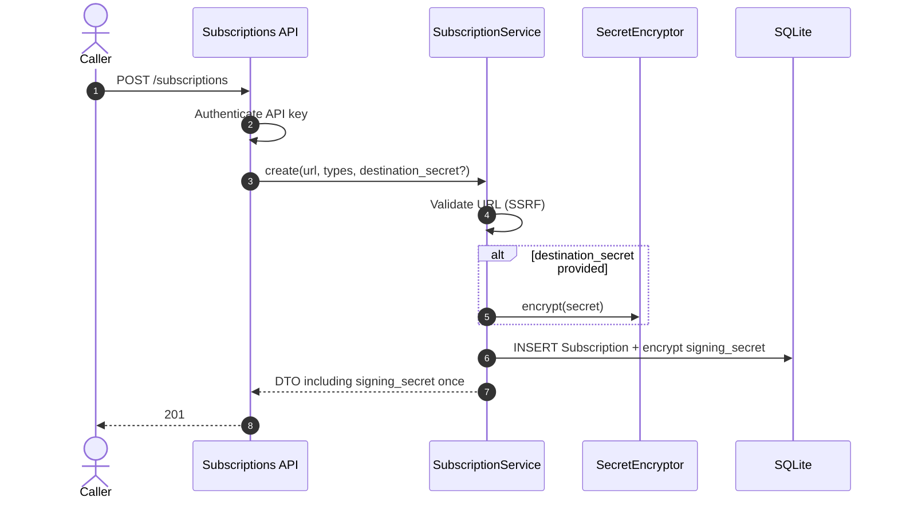
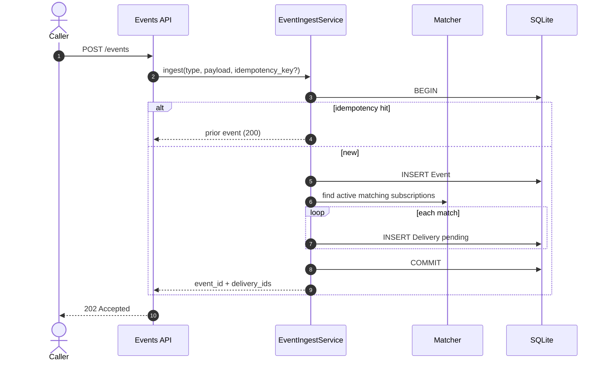
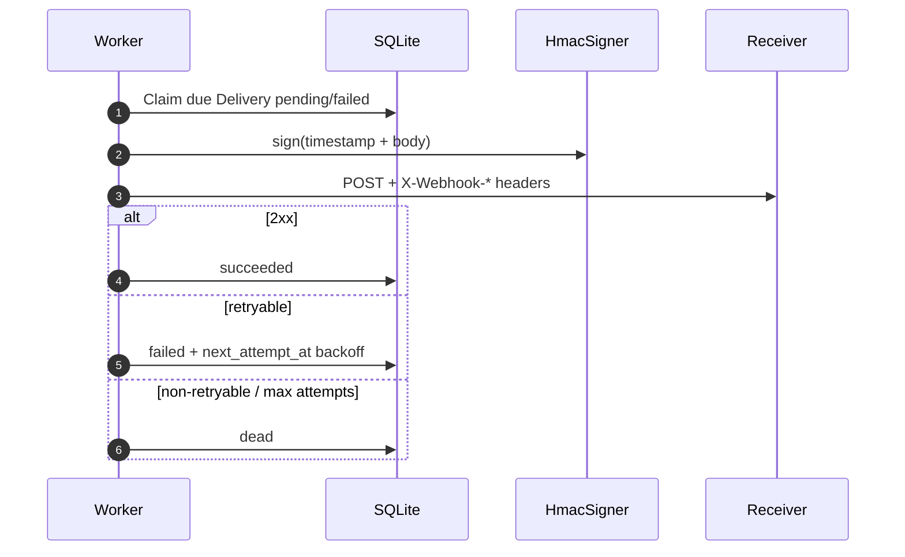
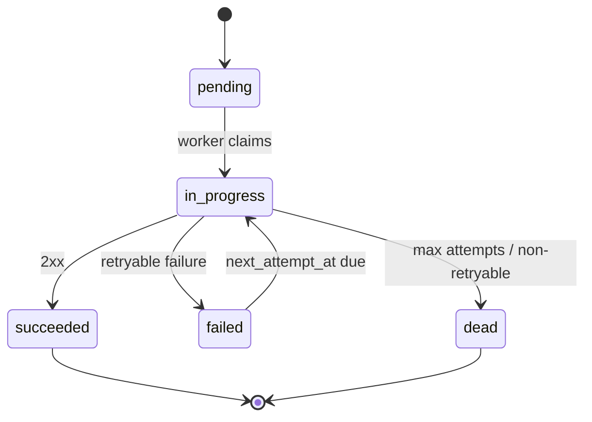

# Architecture Document — Webhook Relay Service

**Project:** `tjmlabs-task`  
**Stack:** Python · Django · django-ninja · SQLite · uv · pytest  
**Status:** Architecture (pre-implementation)  
**Authors:** System Analysis · Backend Architecture · Software Architecture

---

## Executive summary

Build a lean **webhook relay**: callers register destinations and event-type interest; producers submit events once; the service **matches, queues, delivers, retries, signs**, and exposes delivery status—while protecting stored credentials.

**MVP shape:** modular Django monolith, django-ninja REST API, **DB-backed outbox** (`Delivery` rows), management-command worker, HMAC-SHA256 outbound signatures, Fernet-encrypted secrets. No Celery/Redis for the take-home; document the upgrade path.

**Success signal:** correct under flaky destinations, auditable deliveries, named trade-offs, honest deferrals—not distributed-systems theater.

---

## 1. System analysis

### 1.1 Problem statement

Without a relay, producers must fan out themselves, handle retries/timeouts, and prove payload authenticity. This service is a durable middle layer: register destinations → submit events → reliable signed delivery → inspect outcomes.

### 1.2 Actors

| Actor | Goals |
| --- | --- |
| **Publisher** | Submit events once; matching subscriptions get them |
| **Subscriber** | Register destinations; inspect deliveries; trust authenticity |
| **Destination receiver** | Accept signed POSTs; reject forgeries |
| **Operator** | Dependable delivery under SQLite/single-node limits |



### 1.3 Functional requirements (MoSCoW)

**MUST**

| ID | Requirement |
| --- | --- |
| FR-M01 | Create subscription (URL + event types + optional credential); return ids/secrets needed later |
| FR-M02 | Accept event; persist; enqueue delivery to every matching active subscription |
| FR-M03 | HTTP POST each pending delivery with a verifiable body |
| FR-M04 | Retry with backoff on flaky destinations; do not block publish on remote latency |
| FR-M05 | Sign outbound payloads (HMAC + timestamp) |
| FR-M06 | Encrypt destination credentials at rest; never return plaintext on read |
| FR-M07 | Expose delivery status (pending / success / failed / dead, attempts, last error) |
| FR-M08 | Authenticate callers for mutating and sensitive reads |

**SHOULD:** idempotent ingest; deactivate subscription; delivery metadata headers; payload size limits; attempt history; health endpoints.

**COULD (deferred):** manual redelivery; event-type registry; payload predicates; multi-tenant UI; circuit breakers; URL ownership challenge.

### 1.4 Non-functional requirements

| ID | Category | Requirement |
| --- | --- | --- |
| NFR-R01 | Reliability | Publish returns only after event + delivery rows are committed; delivery is async |
| NFR-R02 | Reliability | Timeouts/5xx/network → retry; most 4xx → terminal |
| NFR-R03 | Reliability | At-least-once; receivers must be idempotent |
| NFR-S01–S04 | Security | TLS at edge (prod); HMAC + skew window; Fernet secrets; SSRF controls |
| NFR-O01 | Observability | Structured logs with `event_id`, `delivery_id`, `subscription_id` |
| NFR-P01–P02 | Performance | Fast accept path; mandatory HTTP client timeouts |
| NFR-M01–M02 | Maintainability | Lean deps; pytest for matching, signing, retry, auth, redaction |

### 1.5 Domain vocabulary

| Term | Definition |
| --- | --- |
| **Subscription** | Destination URL + event-type interest + signing material + optional outbound credential |
| **Event type** | Exact-match string label (e.g. `order.created`) |
| **Event** | Immutable accepted message: type + JSON payload |
| **Delivery** | Per-(event, subscription) work unit |
| **Delivery attempt** | One HTTP try |
| **Signing secret** | Per-subscription HMAC key (`whsec_…`), shown once at create/rotate |
| **Destination secret** | Optional Bearer credential for calling the destination; encrypted at rest |



### 1.6 Business rules

- Fan-out to **all active** subscriptions whose event-type set contains the event type.
- Inactive/deleted subscriptions get no new deliveries.
- **At-least-once** delivery (crash between HTTP 2xx and DB commit can duplicate).
- Signing secrets shown at most once (or on rotate); destination secrets never returned after create.
- Payload is opaque JSON; relay does not interpret business fields.
- No Kafka/Celery/Redis in MVP.

### 1.7 Out of scope (MVP)

Celery/Redis/Kafka, multi-tenant console, exactly-once, full KMS rotation UX, payload filtering DSL, URL ownership verification, Prometheus/OTel backends.

### 1.8 Acceptance criteria (testable)

1. Create returns `subscription_id` + signing secret; subsequent GET does not expose destination credential.
2. Matching: `order.created` hits only subscriptions interested in that type.
3. Publish stays fast when destination is slow; delivery records retry/failure asynchronously.
4. Fail-then-succeed destination → `succeeded` with `attempt_count > 1`.
5. Always-fail → terminal `dead` with last error visible.
6. HMAC recomputed with documented scheme matches; tampering fails.
7. Destination credential used on outbound; never in list/get/logs.
8. Inspect API shows status, attempts, timestamps, safe errors.
9. Missing/invalid auth → reject.
10. Same idempotency key → single fan-out.

### 1.9 Assumptions

- Single-tenant / API-key auth (no OAuth).
- Free-form event-type strings.
- In-process worker + DB-as-queue is acceptable.
- Destination credential = single opaque Bearer secret.

---

## 2. Software architecture

### 2.1 Style

**Modular Django monolith** with hexagonal-ish layering: thin django-ninja routers → application services → ORM / HTTP adapters. API and worker share domain services.

**Core patterns:** transactional outbox, at-least-once delivery, idempotent ingest, exponential backoff, HMAC authenticity, encrypted secrets at rest.

### 2.2 C4 — System context



### 2.3 C4 — Containers



### 2.4 Component view



### 2.5 Key sequences

#### Create subscription



#### Ingest event + fan-out



#### Delivery with retry



### 2.6 Delivery status machine



### 2.7 Quality attributes

| Attribute | How architecture addresses it |
| --- | --- |
| Reliability | Same-TX outbox; retries; lease reclaim; inspectable `dead` |
| Security | Hashed API keys; HMAC; Fernet; SSRF deny lists |
| Observability | Structured logs + attempt history API |
| Simplicity | Django + ninja + SQLite + one worker command |
| Evolvability | Job table mirrors a queue message; Postgres/`SKIP LOCKED` later |

### 2.8 Deployment

**Local / take-home:** Process A = API (`runserver`); Process B = `manage.py run_delivery_worker`; shared `db.sqlite3` (WAL).

**Production later:** Postgres, N API workers, N delivery workers (or Celery), TLS LB, KMS, metrics.

### 2.9 Risks & mitigations

| Risk | Mitigation |
| --- | --- |
| SQLite lock contention | WAL, short TX, optimistic claim, prefer single worker locally |
| Poison destination | Max attempts, backoff, `dead` status |
| SSRF | Scheme allowlist + private/metadata IP deny; re-check at send |
| Duplicate deliveries | Stable `X-Webhook-Id`; document at-least-once |
| Stuck `in_progress` | Lease TTL reclaim |

---

## 3. Backend architecture

### 3.1 Auth

| Mechanism | Detail |
| --- | --- |
| Scheme | `Authorization: Bearer <api_key>` |
| Format | `whr_` + urlsafe random |
| Storage | SHA-256 hash; prefix for display |
| Provisioning | Management command / admin (no public signup) |
| Scoping | `ApiKey` → `Account`; all resources account-scoped |

Missing key → `401`. Cross-account → `404`.

### 3.2 API (`/api/v1`)

| Method | Path | Purpose |
| --- | --- | --- |
| POST | `/subscriptions` | Register; returns `signing_secret` once → `201` |
| GET | `/subscriptions` | List (no secrets) |
| GET | `/subscriptions/{id}` | Detail (no signing secret) |
| PATCH | `/subscriptions/{id}` | Update URL/types/secret/active |
| POST | `/subscriptions/{id}/rotate-secret` | New signing secret |
| DELETE | `/subscriptions/{id}` | Soft-delete |
| POST | `/events` | Ingest → `202` (or `200` idempotent replay) |
| GET | `/subscriptions/{id}/deliveries` | Inspect |
| GET | `/deliveries/{id}` | Detail + attempt history |
| GET | `/healthz`, `/readyz` | Liveness / DB ready |

**Event ingest body**

```json
{
  "event_type": "order.created",
  "payload": { "order_id": "ord_123" },
  "idempotency_key": "optional-client-key"
}
```

**Error envelope:** `{ "error": { "code": "...", "message": "...", "details": {} } }`

**Limits:** payload ≤ 64 KiB; event types 1–20 per subscription; pattern `^[a-z][a-z0-9_.-]{0,63}$`.

### 3.3 Data model

```
Account 1──* ApiKey
Account 1──* Subscription
Account 1──* Event
Subscription 1──* Delivery
Event 1──* Delivery
Delivery 1──* DeliveryAttemptLog
```

**Notable fields**

- `Subscription.event_types` — JSON list (MVP; normalize lowercase on write)
- `Subscription.signing_secret_encrypted` / `destination_secret_encrypted` — Fernet
- `Event` — unique `(account_id, idempotency_key)` when key set; `payload_hash` for conflict detection
- `Delivery` — unique `(subscription_id, event_id)`; `status`, `attempt_count`, `max_attempts=4`, `next_attempt_at`, `lock_token`, `locked_at`
- Indexes: `(status, next_attempt_at)` for worker; `(subscription_id, created_at)` for inspect

### 3.4 Delivery engine

| Concern | Policy |
| --- | --- |
| Accept path | Persist event + deliveries only; **no outbound HTTP** |
| Worker | `manage.py run_delivery_worker` |
| Claim | Optimistic `pending/failed` → `in_progress` + `lock_token`; lease reclaim ~2 min |
| Timeout | 5s connect+read (stdlib `urllib`) |
| Attempts | 4 total (1 + 3 retries) |
| Backoff | **1s → 5s → 25s** |
| Retryable | timeout, connection error, 408, 429, 5xx |
| Non-retryable | 400, 401, 403, 404, 410, SSRF block → immediate `dead` |
| Success | 2xx → `succeeded` |
| Concurrency | Default 4 in-flight POSTs; poll ~0.5–1s when empty |

**Outbound headers**

| Header | Value |
| --- | --- |
| `Content-Type` | `application/json` |
| `User-Agent` | `WebhookRelay/1.0` |
| `X-Webhook-Id` | delivery id |
| `X-Webhook-Timestamp` | Unix seconds |
| `X-Webhook-Signature` | `v1=<hmac_sha256_hex>` |
| `X-Webhook-Event-Type` | event type |
| `X-Webhook-Event-Id` | event id |
| `Authorization` | `Bearer <destination_secret>` if present |

**Signature canonical string:** `{timestamp}.{raw_body_bytes}`  
Receiver skew window: **±300 seconds**.

### 3.5 Security

- **API keys:** hash at rest; `compare_digest`; never log full key.
- **Fernet:** env `WEBHOOK_RELAY_FERNET_KEY` (separate from `DJANGO_SECRET_KEY`).
- **SSRF:** `https` only in prod (`http` only if `ALLOW_INSECURE_WEBHOOKS`); reject URL userinfo; deny loopback/private/link-local/metadata; no redirects; re-validate at send (DNS rebinding).
- **Secrets:** never in logs or read APIs; signing secret only on create/rotate.

### 3.6 Observability

JSON structured logs: `request_id`, `account_id`, `event_id`, `delivery_id`, `subscription_id`, `duration_ms`, `http_status`.  
Lightweight metrics hooks (log counters): accepted events, enqueued/succeeded/dead deliveries, queue depth. Swap for Prometheus later.

### 3.7 Testing (pytest)

| Layer | Coverage |
| --- | --- |
| Unit | Signing, Fernet, SSRF, retry delays, matching |
| API | Create (secret once), ingest 202, idempotency 200/409, auth 401, deliveries list |
| Delivery | Mocked HTTP: 503→retry, 400→dead, timeout→retry, 200→success; lease reclaim |

### 3.8 Project layout

```text
tjmlabs-task/
├── pyproject.toml
├── uv.lock
├── manage.py
├── README.md
├── artifacts/
│   └── architecture.md          # this document
├── config/                      # settings, urls, NinjaAPI, logging, wsgi
├── apps/
│   ├── accounts/                # Account, ApiKey, auth, create_api_key
│   ├── webhooks/
│   │   ├── models.py
│   │   ├── schemas.py
│   │   ├── api.py
│   │   ├── services/            # subscriptions, events, matching, deliveries
│   │   ├── delivery/            # worker, http_client, signing, retry, ssrf
│   │   ├── crypto.py
│   │   └── management/commands/run_delivery_worker.py
│   └── common/                  # ids, errors, pagination, metrics
└── tests/
    ├── unit/
    ├── api/
    └── delivery/
```

### 3.9 Dependencies (uv)

**Pin:** `django`, `django-ninja`, `cryptography`, `pytest`, `pytest-django`.

**Avoid:** Celery, Redis, RQ, `requests` (use stdlib `urllib`), standalone pydantic, sentry (later).

---

## 4. Architecture decision records

### ADR-001 — DB-backed queue, not Celery/Redis
Durable fan-out, retries, and inspection with lean ops. Job schema stays portable for a real broker later.

### ADR-002 — Transactional outbox on ingest
Insert `Event` + matching `Delivery` rows in one transaction; return `202` after commit. Prevents accepted-but-lost deliveries.

### ADR-003 — At-least-once with attempt history
Immutable `DeliveryAttemptLog`; lease reclaim after worker crash. Exactly-once needs receiver cooperation—document idempotency via event/delivery ids.

### ADR-004 — HMAC-SHA256 + timestamp
Industry-familiar authenticity/integrity without mTLS. Canonical `{timestamp}.{body}`; ±5 minute skew guidance.

### ADR-005 — Fernet for secrets at rest
Encrypt signing + destination secrets; decrypt only in worker/rotate path. Env key now; KMS later.

### ADR-006 — Hexagonal-ish Django, shared services
Thin routers; use cases in services; ORM/HTTP as adapters. API and worker share delivery/crypto code.

### ADR-007 — SSRF controls on write and deliver
Scheme allowlist + private/metadata deny; re-check before HTTP. A relay is otherwise an SSRF proxy.

### ADR-008 — SQLite WAL + optimistic claim
Status CAS + leases; single-worker happy path locally. Maps cleanly to Postgres `SKIP LOCKED` later.

### ADR-009 - Implementation decision
Core slice — create/get subscription, send event, list deliveries, worker (retry + HMAC + Fernet), API-key auth, essential tests + README (skip rotate, soft-delete, pagination polish, heavy SSRF)

---

## 5. Trade-offs summary

| Decision | Chose | Rejected | Why |
| --- | --- | --- | --- |
| Queue | DB outbox + management command | Celery + Redis | Lean; enough for take-home |
| Event types | JSONField list | M2M join table | Simpler at low volume |
| Ingest vs deliver | Async enqueue only | Sync HTTP in request | Protects API from flaky destinations |
| Retries | 4 attempts, 1s/5s/25s | Unlimited long backoff | Predictable MVP |
| Signing | HMAC + timestamp | JWT / mTLS | Standard webhook pattern |
| Auth | Hashed API keys per Account | OAuth2 | Right size for S2S MVP |
| IDs | Prefixed ULID/UUID | Numeric only | Safer external refs |

---

## 6. Evolution path

### Build now
Subscriptions (+ rotate/soft-delete), event ingest + fan-out, worker with retry/HMAC/SSRF, delivery inspection, API keys, Fernet secrets, pytest, README (decisions / harden later / left out).

### Harden before production
Postgres + `SKIP LOCKED`, multi-worker fairness, circuit breaker / auto-disable chronic failures, KMS + secret rotation UX, rate limits, full SSRF egress policy, metrics/tracing, TLS-only destinations, delivery replay API.

### Deliberately left out
Public signup UI, payload transformation DSL, multi-region brokers, exactly-once, admin dashboard.

---

## 7. Open design choices (resolved for implementation)

| Question | Resolution for MVP |
| --- | --- |
| Auth model | Account-scoped API keys; bootstrap via management command |
| Publish status | `202 Accepted` (new); `200` on idempotent replay |
| Retry taxonomy | 408/429/5xx + network/timeout; other 4xx → `dead` |
| SSRF | Implement basic controls in MVP (not deferred) |
| Claim concurrency | Optimistic `lock_token` / status CAS |
| Subscription delete | Soft-delete; preserve delivery history |
| Clock skew | Document ±300s for receivers |

---

*End of architecture document.*
