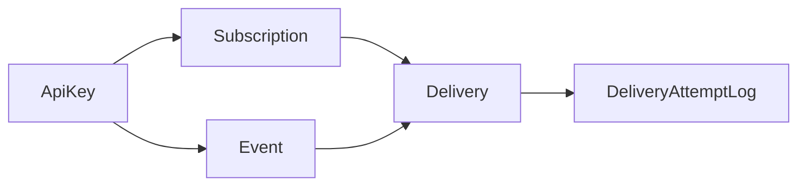
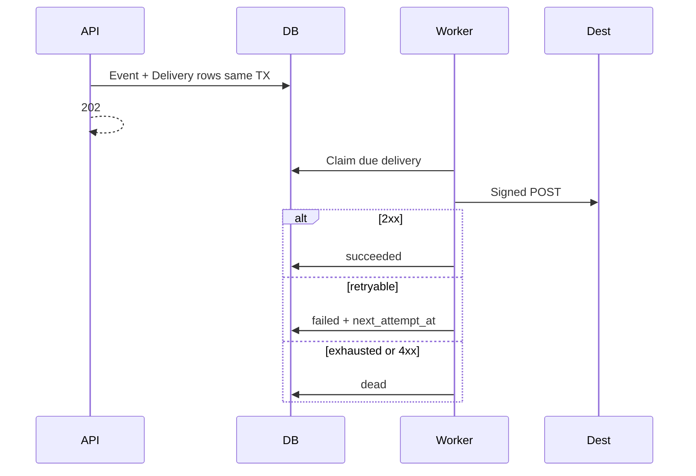

# Implement Webhook Relay (Core Slice)

Greenfield build in [`tjmlabs-task/`](tjmlabs-task/) from [`requirements.md`](tjmlabs-task/requirements.md) and [`artifacts/architecture.md`](tjmlabs-task/artifacts/architecture.md), **scoped to core only** (your choice: option 2).

## Scope

**In**
- Create + get subscription (signing secret returned once on create)
- Send event → match → enqueue deliveries → `202`
- List deliveries for a subscription
- API-key auth (`Bearer`)
- Worker: claim → sign → POST → retry (1s/5s/25s) → `dead`
- HMAC-SHA256 + timestamp outbound headers
- Fernet encryption for signing + optional destination secrets
- Essential pytest + README (decisions / harden later / left out)

**Out (document as deliberate omissions)**
- Rotate-secret, PATCH, soft-delete, cursor pagination polish
- Account multi-tenancy UI / public signup
- Aggressive SSRF (private-IP/DNS rebinding); allow `http://127.0.0.1` in DEBUG for local tests
- Delivery detail-by-id, healthz polish, metrics hooks, Celery/Redis

## Concrete defaults (locked)

| Concern | Choice |
| --- | --- |
| Auth | Single `ApiKey` model (hashed); bootstrap via `create_api_key` — no separate `Account` table for core |
| IDs | Prefixed UUID4 (`sub_`, `evt_`, `dlv_`, `whr_`, `whsec_`) — no ULID dep |
| Queue | `Delivery` rows + `manage.py run_delivery_worker` |
| Retries | max 4 attempts; backoff 1s / 5s / 25s; retryable = timeout/network/408/429/5xx |
| HTTP client | stdlib `urllib.request`, 5s timeout, no redirects |
| Crypto | `cryptography` Fernet via `WEBHOOK_RELAY_FERNET_KEY` |
| Event types | JSON list on subscription; exact-match; lowercase normalize |
| Idempotency | Optional `idempotency_key` on ingest (unique when set) |
| Destination URL | Require absolute URL; DEBUG allows `http://127.0.0.1` / `localhost`; prod settings prefer `https` |

## Target layout

```text
tjmlabs-task/
  pyproject.toml, uv.lock, manage.py, README.md, .env.example
  config/          # settings, urls, api (NinjaAPI), wsgi
  apps/
    accounts/      # ApiKey model, Bearer auth, create_api_key command
    webhooks/      # models, schemas, api routers, services, delivery/, crypto.py
    common/        # ids, errors
  tests/           # unit + api + delivery
  artifacts/       # existing architecture.md (unchanged)
```

## API surface (core)

| Method | Path | Notes |
| --- | --- | --- |
| POST | `/api/v1/subscriptions` | body: `destination_url`, `event_types`, optional `destination_secret` → `201` + `signing_secret` once |
| GET | `/api/v1/subscriptions/{id}` | no secrets |
| POST | `/api/v1/events` | `event_type`, `payload`, optional `idempotency_key` → `202` |
| GET | `/api/v1/subscriptions/{id}/deliveries` | status, attempts, last_error, timestamps |

Auth on all of the above: `Authorization: Bearer <api_key>`.

Outbound headers (worker): `X-Webhook-Id`, `X-Webhook-Timestamp`, `X-Webhook-Signature` (`v1=<hex>`), `X-Webhook-Event-Type`, `X-Webhook-Event-Id`; optional `Authorization: Bearer <destination_secret>`.

Canonical HMAC string: `{timestamp}.{raw_body_bytes}`.

## Data model (minimal)



- **ApiKey**: `key_prefix`, `key_hash`, `is_active`
- **Subscription**: `destination_url`, `event_types` (JSON), encrypted secrets, `is_active`, timestamps
- **Event**: `event_type`, `payload` (JSON), `idempotency_key` nullable unique, `payload_hash`
- **Delivery**: `status` (`pending`/`in_progress`/`failed`/`succeeded`/`dead`), `attempt_count`, `max_attempts`, `next_attempt_at`, `lock_token`, `last_http_status`, `last_error`; unique `(subscription, event)`
- **DeliveryAttemptLog**: attempt number, http status, error snippet, duration_ms

## Delivery flow



Claim: optimistic CAS (`pending`/`failed` + due → `in_progress` + `lock_token`); reclaim stale leases (~2 min).

## Implementation order

1. **Scaffold** — `uv init` / Django project, pin `django`, `django-ninja`, `cryptography`, `pytest`, `pytest-django`; settings (SQLite WAL, env keys, DEBUG URL policy).
2. **Common + crypto + ids** — prefixed UUID helpers, Fernet encrypt/decrypt, error envelope.
3. **Accounts** — `ApiKey` model, ninja Bearer auth, `create_api_key` command.
4. **Webhooks models + migrations** — Subscription, Event, Delivery, DeliveryAttemptLog.
5. **Services + API** — create/get subscription; ingest + matching + enqueue; list deliveries.
6. **Delivery pipeline** — `signing.py`, `retry.py`, `http_client.py`, light URL validation, `worker.py`, `run_delivery_worker`.
7. **Tests** — unit (HMAC, Fernet, retry delays, matching); API (auth 401, create secret-once, fan-out, idempotency); delivery (mocked urllib: 503→retry, 400→dead, 200→success).
8. **README** — how to run (API + worker), create API key, key decisions, harden-before-prod, deliberate omissions (incl. full SSRF / rotate / soft-delete).

## README must answer (brief requirement)

- Key decisions and why (outbox worker, HMAC, Fernet, no Celery, API keys)
- What you'd harden before production (Postgres, SSRF, multi-worker, rate limits, KMS)
- What was deliberately left out (rotate, soft-delete, pagination, Celery, etc.)

## Done when

- `uv sync` + migrate + create API key works
- Core four endpoints behave as above
- Worker delivers with signature and retries flaky destinations
- `pytest` green for essential coverage
- README present and honest about scope

---

## todos:

- [-] Scaffold Django + uv project, settings, NinjaAPI, pinned deps
- [-] ApiKey auth, Fernet crypto, prefixed IDs, create_api_key command
- [-] Subscription/Event/Delivery/Attempt models + migrations
- [-] Core APIs: create/get subscription, ingest event, list deliveries
- [-] Delivery worker: claim, HMAC sign, HTTP POST, retry/dead
- [-] Essential pytest suite + README (decisions, harden, omissions)

---